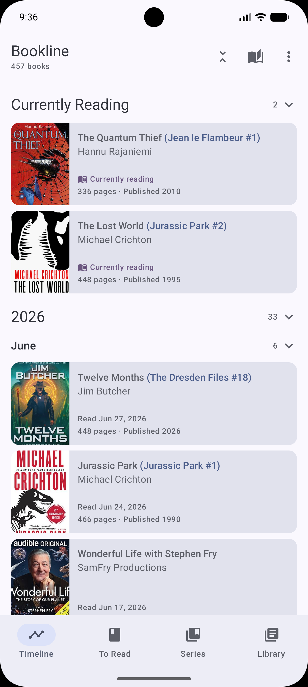
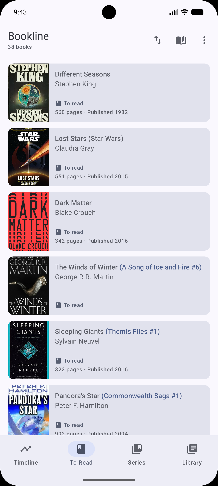
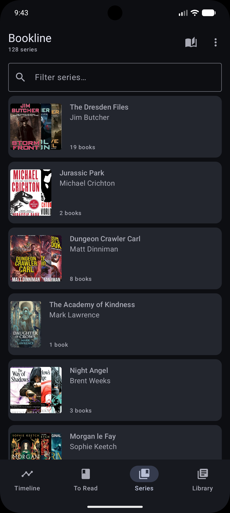
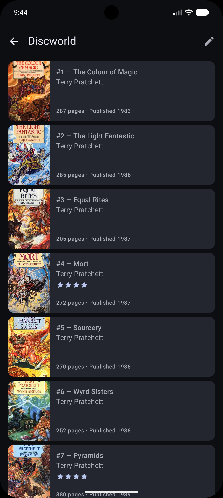
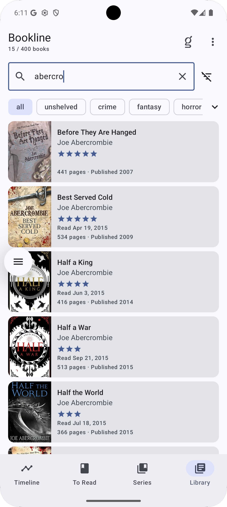
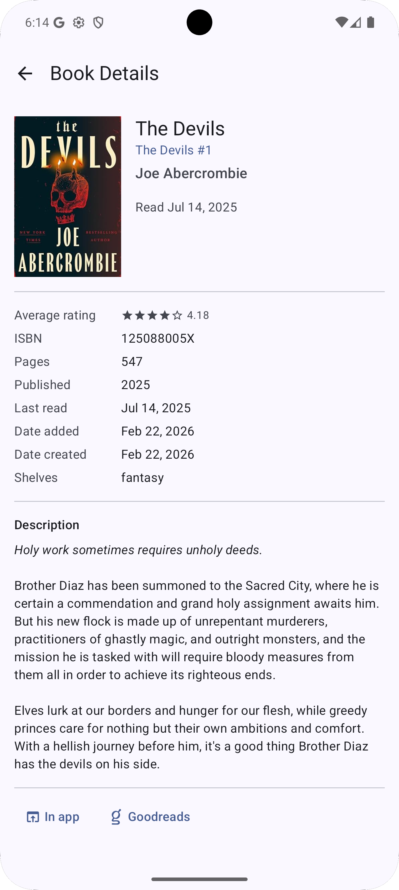
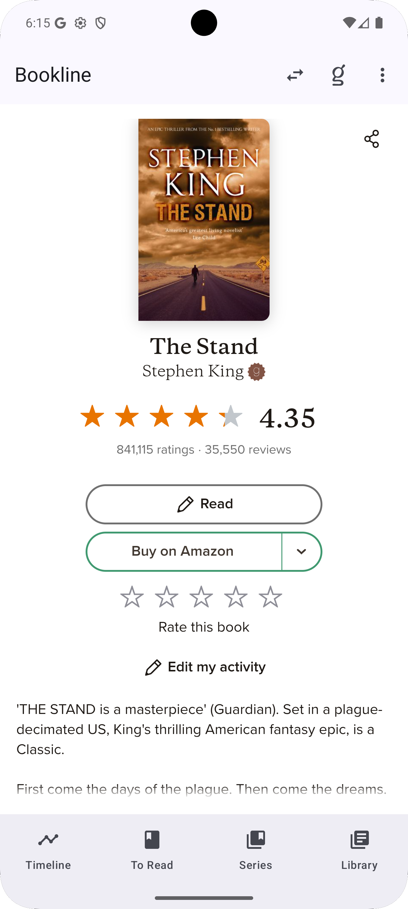

# 📚 Bookline

**A timeline for your books.**

Bookline is an Android app that reads the RSS feed exported from
[Goodreads](https://www.goodreads.com/) and presents your read (and to-read)
books in a beautiful, visually rich timeline — giving you a fresh perspective on
your reading journey.

## ✨ Features

### Core Screens

- **Reading Timeline** — your books laid out chronologically, grouped by year and
  month with collapsible sections. A "Currently Reading" section sits at the top.
  Collapse/expand individual sections or all at once via the top bar toggle.
- **To Read** — your to-read shelf with manual **drag-to-reorder** support. Long-
  press a drag handle to reposition books; positions persist across syncs. Haptic
  feedback and elevation animation while dragging.
- **Series** — browse your book series as cards with a fan of overlapping covers.
  Filter series by name. Tap a series to see all books in reading order.
- **Library** — search all your books by title or author, and filter by Goodreads
  shelf using horizontal filter chips. Results update in real time.

### Book Detail

- Full cover image (tap to view full-screen), title, author, user rating (stars),
  reading status, and formatted read date
- Series membership with position number — tap a series name to jump to its
  detail view
- Metadata section: average rating, ISBN, page count, published year, dates
  added/created, and shelves
- HTML-rendered book description from Goodreads
- "View on Goodreads" button opens the book's page in the embedded browser

### Series Detail

- All books in a series listed by position number
- Series rename / merge functionality (edit icon in top bar)
- Alias display ("Also known as: …") when a series has been renamed

### Goodreads Integration

- **RSS feed sync** — automatic background sync on app resume; manual
  pull-to-refresh on every screen
- **Embedded Goodreads browser** — accessible from the globe icon in the top bar
  on any screen. Supports JavaScript, DOM storage, and in-WebView back
  navigation.
- **Offline-ready** — books are cached locally in Room so you can browse your
  collection without a network connection

### Look & Feel

- **Material You theming** — dynamic color support with Material 3
- **Dark mode** — full light and dark theme support
- **Animated UI** — section collapse/expand chevron rotation, drag elevation,
  save-confirmation fade animations

## 📸 Screenshots

| Timeline                              | To Read                             | Series                                |
|---------------------------------------|-------------------------------------|---------------------------------------|
|  |  |  |

| Series Detail                                   | Library                             |
|-------------------------------------------------|-------------------------------------|
|  |  |

| Book Detail                                  | Goodreads                                            |
|----------------------------------------------|------------------------------------------------------|
|  |  |

## 🏗️ Tech Stack

| Layer             | Technology                                     |
|-------------------|------------------------------------------------|
| **Language**      | Kotlin 2.3+                                    |
| **UI**            | Jetpack Compose with Material 3 / Material You |
| **Async**         | Kotlin Coroutines + Flow                       |
| **Networking**    | HttpURLConnection (no library needed for RSS)  |
| **Image loading** | Coil 3 (Compose)                               |
| **Local storage** | Room                                           |
| **Navigation**    | Compose Navigation                             |
| **Minimum SDK**   | 28 (Android 9 Pie)                             |
| **Target SDK**    | 36                                             |
| **Build system**  | Gradle 9 (Kotlin DSL) with version catalog     |
| **Architecture**  | Single-activity MVVM, single module            |
| **DI**            | Manual constructor injection (no Hilt/Dagger)  |

> For a deeper dive into the architecture, data flow, and package layout see
> [`ARCHITECTURE.md`](ARCHITECTURE.md).

## 🚀 Getting Started

### Prerequisites

- **Android Studio** Meerkat (2024.3+) or newer
- **JDK 11** or newer
- An Android device or emulator running **API 28+**

### Build & Run

```bash
# Clone the repository
git clone https://github.com/thaapasa/bookline.git
cd bookline

# Build a debug APK
./gradlew assembleDebug

# Install on a connected device / emulator
./gradlew installDebug
```

### Goodreads RSS Feed

To use Bookline you need your Goodreads RSS feed URL. You can find it on your
Goodreads profile:

1. Go to **My Books** on Goodreads.
2. At the bottom of the page, find the **RSS** link for your shelf.
3. Copy the URL and paste it into Bookline's settings.

## 🗂️ Project Structure

```
bookline/
├── app/
│   └── src/main/
│       ├── java/fi/pomeranssi/bookline/
│       │   ├── data/                # Data layer (db, network, repository)
│       │   ├── domain/model/        # Domain models (Book, Series, etc.)
│       │   ├── ui/                  # Presentation layer
│       │   │   ├── common/          # Shared utilities (SyncHelper, DateFormatters)
│       │   │   ├── components/      # Shared composables (BookCard, SearchField, etc.)
│       │   │   ├── navigation/      # App scaffold, routes, bottom nav
│       │   │   ├── timeline/        # Timeline screen + ViewModel
│       │   │   ├── shelves/         # To Read screen + ViewModel
│       │   │   ├── series/          # Series list & detail screens + ViewModels
│       │   │   ├── library/         # Library screen + ViewModel
│       │   │   ├── detail/          # Book detail screen + ViewModel
│       │   │   ├── goodreads/       # Embedded Goodreads WebView
│       │   │   ├── settings/        # Settings screen + ViewModel
│       │   │   └── theme/           # Material 3 theming
│       │   └── MainActivity.kt
│       └── res/                     # Resources & drawables
├── gradle/
│   └── libs.versions.toml           # Version catalog
├── ARCHITECTURE.md                  # Detailed architecture documentation
├── build.gradle.kts
└── README.md
```

## 🔒 Privacy

Bookline collects no user data and includes no analytics or telemetry. All data
(feed URL, cached books) stays on your device, and network requests go only to
Goodreads. See the full
[privacy policy](https://pomeranssi.fi/bookline/privacy-policy.html) — also
linked from the in-app About screen (top bar menu), which shows the app version
and a link to this repository.

## 🤝 Contributing

Contributions, issues, and feature requests are welcome! Feel free to open an
issue or submit a pull request.

## 📄 License

This project is licensed under the [MIT License](LICENSE).

---

_Built with ❤️ and Jetpack Compose._

